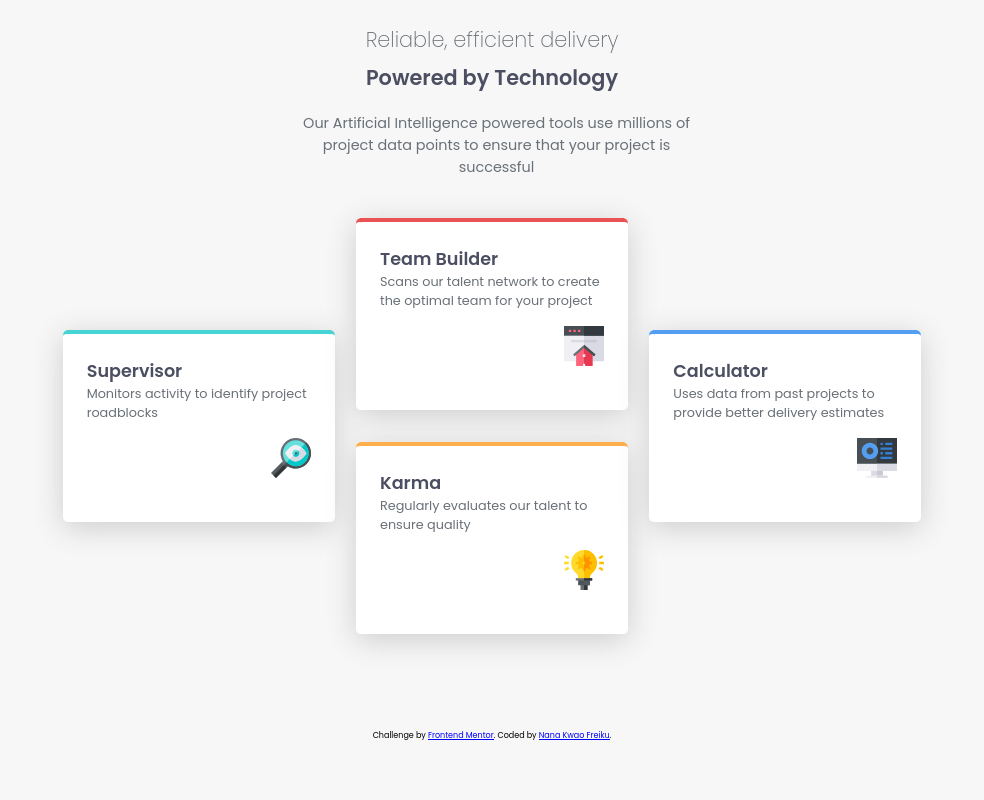
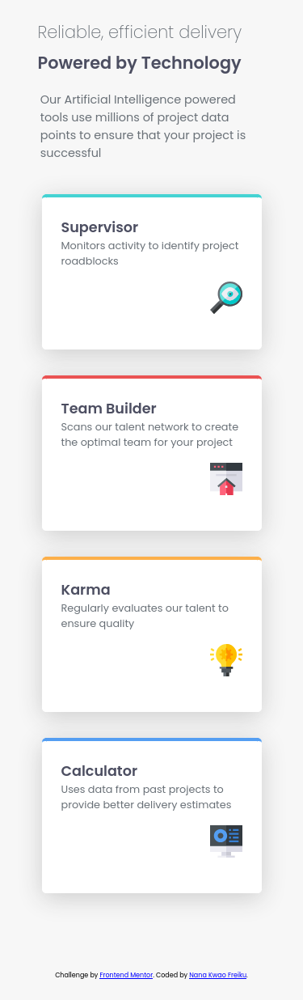

# Frontend Mentor - Four card feature section solution

This is a solution to the [Four card feature section challenge on Frontend Mentor](https://www.frontendmentor.io/challenges/four-card-feature-section-weK1eFYK). Frontend Mentor challenges help you improve your coding skills by building realistic projects.

## Overview

This project is a solution to the Four card feature section challenge from Frontend Mentor. The goal was to create a responsive feature section using semantic HTML and modern CSS. The component displays four feature cards, each with a title, description, icon, and a colored border, arranged responsively for both mobile and desktop layouts.

The project focuses on semantic HTML structure, responsive design using Flexbox and CSS Grid, and custom styling with CSS variables and custom fonts. The page is fully responsive and adapts well to different screen sizes, making it suitable for both desktop and mobile devices.

### Screenshot




### Links

- Solution URL: [https://github.com/nana-kwao/four-card-feature-challenge](https://github.com/nana-kwao/four-card-feature-challenge)
- Live Site URL: [https://nana-kwao.github.io/four-card-feature-challenge](https://nana-kwao.github.io/four-card-feature-challenge)

## Built with

- Semantic HTML5 markup
- CSS custom properties
- Flexbox
- CSS Grid
- Mobile-first workflow

## What I learned

While working on this project, I strengthened my understanding of semantic HTML and responsive design using both Flexbox and CSS Grid. I learned how to structure a feature section with clear, accessible markup, use custom fonts for improved aesthetics, and apply CSS variables for consistent theming. I also practiced making the layout adapt well to different screen sizes and using CSS Grid for complex desktop layouts.

Here are some code snippets that highlight what I learned:

```html
<main>
  <section>
    <h2>Supervisor</h2>
    <p>Monitors activity to identify project roadblocks</p>
    
  </section>
  <!-- ...other sections... -->
</main>
```

```css
main {
  width: 100%;
  display: flex;
  flex-direction: column;
  align-items: center;
  margin: 0 auto;
}
@media screen and (min-width: 56em) {
  main {
    width: 55em;
    display: grid;
    place-items: center;
    grid-template-columns: repeat(6, 1fr);
    grid-template-rows: repeat(4, 1fr);
  }
}
```

## Author

- Frontend Mentor - [@nana-kwao](https://www.frontendmentor.io/profile/nana-kwao)
- Twitter - [@f_nanakwao](https://www.twitter.com/f_nanakwao)

## Acknowledgments

Thanks to the Frontend Mentor community for inspiration and assistance. Special thanks to those who provided feedback
